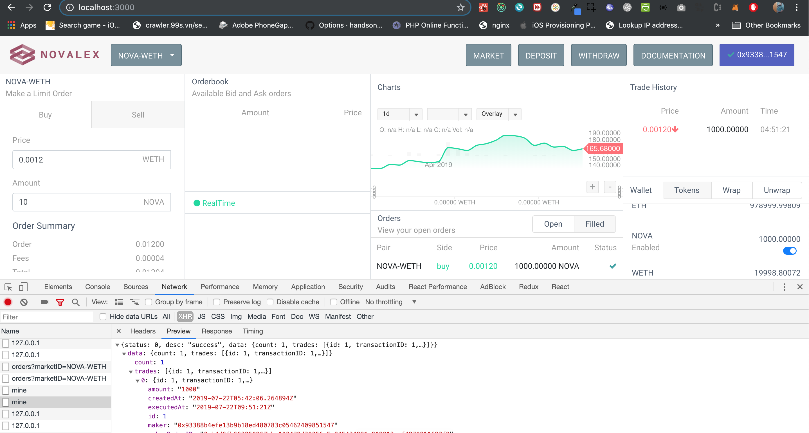

# Nova Box Dex Frontend

This is the front end of the Nova box dex project. It's developed using react. The project is created by the [create-react-app](https://github.com/facebook/create-react-app) command.

## How to develop

### Step 0: Install dependences

	yarn

### Step 1: Start server

	yarn start

## How to build

### Step 0: Install dependences

	yarn

### Step 1: Build

	yarn build

## How to develop modules [sdk-charts & sdk-wallets]

### Step 0: Install nsi package globally

	npm i -g npm-safe-install

### Step 1: Install modules as symlink modules	

	cd sdk-charts && npm link && nsi
	cd sdk-wallets && npm link && nsi

## Build docker

	`docker build -q -t novaprotocolio/nova-scaffold-dex-web:latest .`

